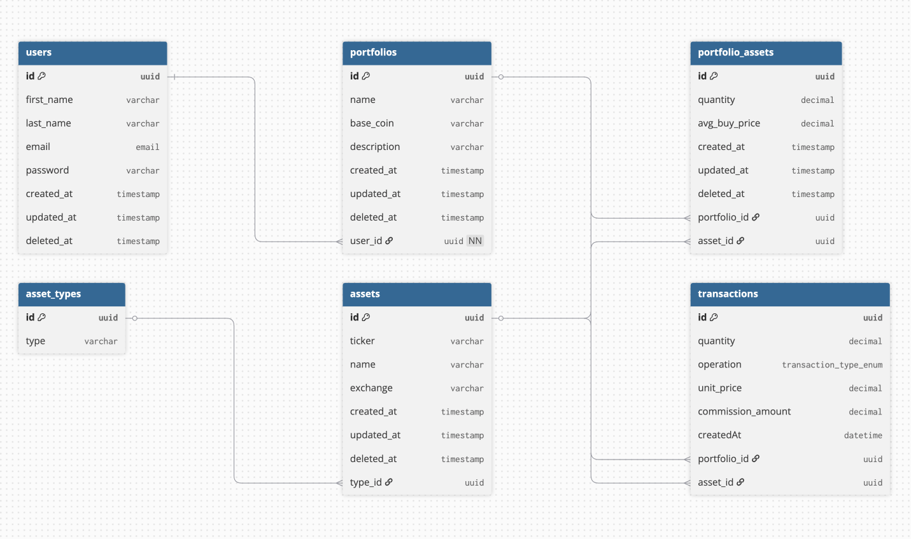

# Database

## Diagram



## Schema (dbdiagram.io)

Paste the following DBML into [dbdiagram.io](https://dbdiagram.io) to visualize the schema.

```dbml
// Use DBML to define your database structure
// Docs: https://dbml.dbdiagram.io/docs

Table users {
  id uuid [pk]
  first_name varchar
  last_name varchar
  email email
  password varchar
  created_at timestamp
  updated_at timestamp
  deleted_at timestamp
}

Table portfolios {
  id uuid [pk]
  name varchar
  base_coin varchar
  description varchar [null]
  created_at timestamp
  updated_at timestamp
  deleted_at timestamp
  user_id uuid [not null]
}

Table portfolio_assets {
  id uuid [pk]
  quantity decimal
  avg_buy_price decimal
  created_at timestamp
  updated_at timestamp
  deleted_at timestamp
  portfolio_id uuid
  asset_id uuid
}

Table asset_types {
  id uuid [pk]
  type varchar
}

Table assets {
  id uuid [pk]
  ticker varchar
  name varchar
  exchange varchar
  created_at timestamp
  updated_at timestamp
  deleted_at timestamp
  type_id uuid
}

Enum transaction_type {
  BUY
  SELL
}

Table transactions {
  id uuid [pk]
  quantity decimal
  operation transaction_type_enum
  unit_price decimal
  commission_amount decimal
  createdAt datetime
  portfolio_id uuid
  asset_id uuid
}

Ref user_portfolios: portfolios.user_id > users.id

Ref assets_asset_types: assets.type_id > asset_types.id

Ref transactions_portolio: transactions.portfolio_id > portfolios.id
Ref transactions_assets: transactions.asset_id > assets.id

Ref portfolio_assets_portfolio: portfolio_assets.portfolio_id > portfolios.id
Ref portfolio_assets_asset: portfolio_assets.asset_id > assets.id
```
